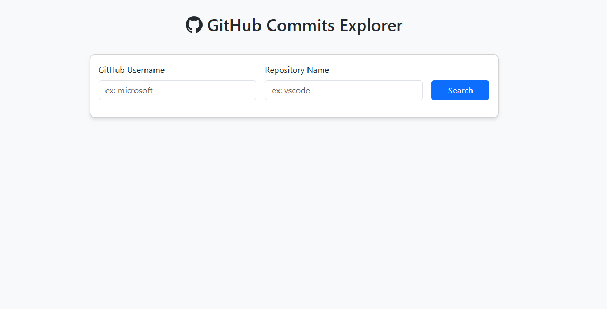

# Projeto2a: GitHub API e DOM Manipulation

#### Deploy

https://elc1090.github.io/project2a-2025a-GabrielUFSM/

#### Desenvolvedor(a)

Gabriel Bisognin Moro - Ciência da computação

#### Ambiente de desenvolvimento

[Vscode](https://code.visualstudio.com/)   
[VScode Live Preview](https://marketplace.visualstudio.com/items?itemName=ms-vscode.live-server)   

#### Créditos

https://docs.github.com/pt/rest?apiVersion=2022-11-28
https://api.github.com/users/elc1090/repos

#### Bastidores

Reaproveitei muito do código do primeiro trabalho como base. O desafio principal foi implementar a busca de commits específicos de um repositório. Aprender como utilizar com a API do GitHub, foi um processo bem tranquilo. Também fiz um design responsivo bem básico com Bootstrap.

---
Projeto entregue para a disciplina de [Desenvolvimento de Software para a Web](http://github.com/andreainfufsm/elc1090-2025a) em 2025a
