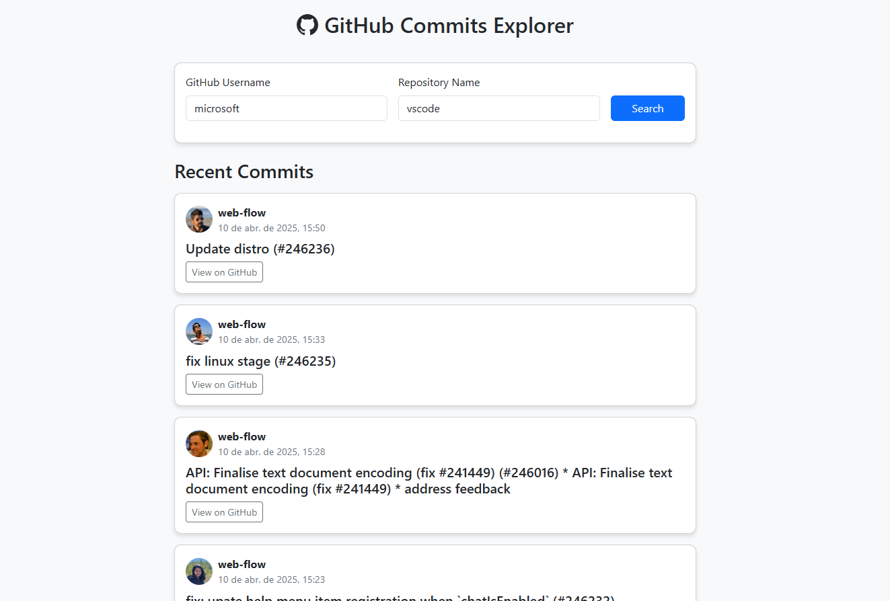

# Projeto2a: GitHub API e DOM Manipulation

#### Deploy

https://elc1090.github.io/project2a-2025a-GabrielUFSM/

#### Desenvolvedor(a)

Preencha aqui seu nome

#### Ambiente de desenvolvimento

Preencha aqui uma lista detalhada de ferramentas de desenvolvimento usadas, por exemplo:
- VS Code
- Outras

#### Créditos

Preencha aqui uma lista detalhada de recursos aproveitados no projeto, por exemplo:
- URL de tutoriais/vídeos consultados
- Créditos para colegas que colaboraram

#### Bastidores

Preencha aqui um breve relato dos bastidores da realização deste exercício, com suas impressões.

---
Projeto entregue para a disciplina de [Desenvolvimento de Software para a Web](http://github.com/andreainfufsm/elc1090-2025a) em 2025a
